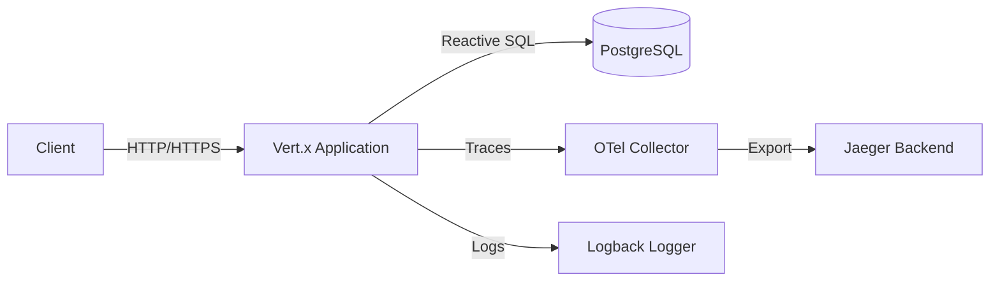
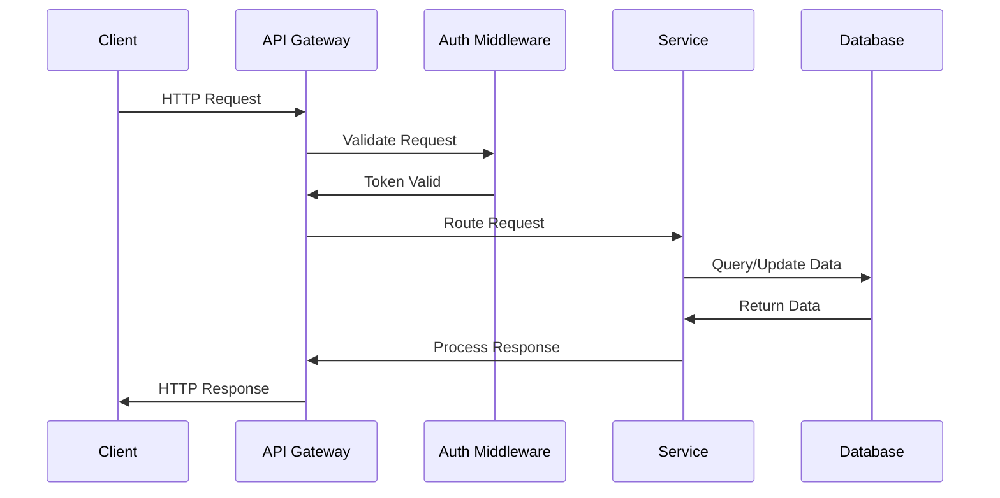
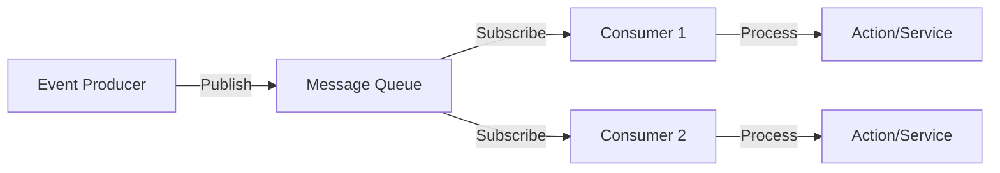
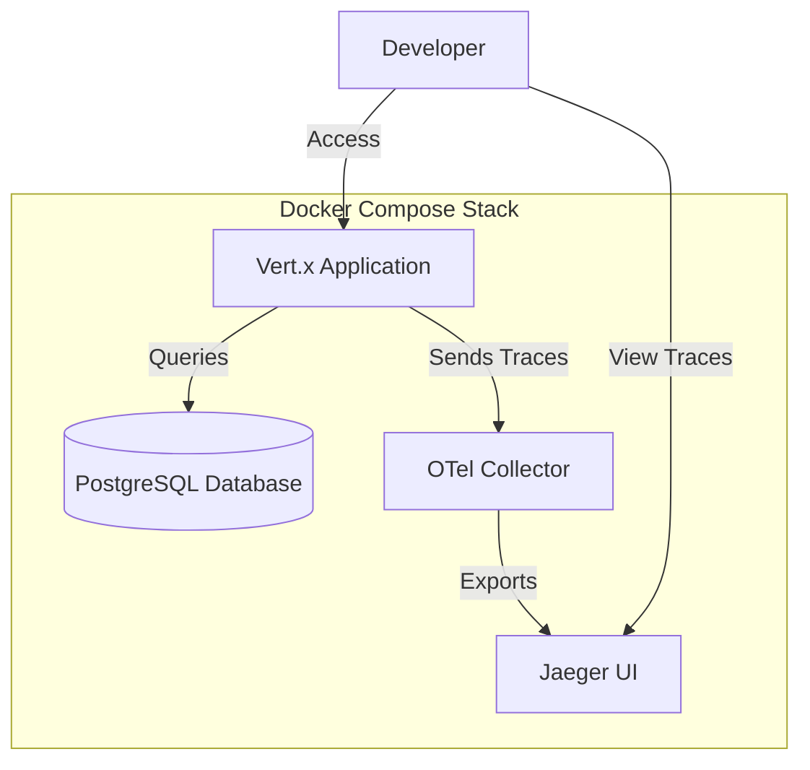

# Architecture & Stack

**Last Updated:** 2025-12-28

This document describes the service architecture, design patterns, and technology stack for this project. Update this document as the architecture evolves.

## Table of Contents

- [System Overview](#system-overview)
- [Technology Stack](#technology-stack)
- [Service Architecture](#service-architecture)
- [Design Patterns](#design-patterns)
- [Data Flow](#data-flow)
- [Infrastructure](#infrastructure)

## System Overview

[Describe the high-level purpose and scope of your system]

### Key Components

- **Component 1**: [Description]
- **Component 2**: [Description]
- **Component 3**: [Description]

## Technology Stack

### Core Technologies

- **Language**: Kotlin
- **Runtime**: JVM
- **Build Tool**: Gradle
- **Framework**: Eclipse Vert.x (reactive toolkit)

### Database & Storage

- **Primary Database**: PostgreSQL
- **Database Client**: Vert.x Postgres Client (reactive PostgreSQL driver)

### Observability

- **Tracing**: OpenTelemetry (OTel) with Vert.x integration
- **Trace Backend**: Jaeger (for local development and visualization)
- **Logging**: Logback

### Testing

- **Test Framework**: Kotest (Kotlin test framework with FunSpec style)
- **Assertions**: Kotest matchers (fluent assertion library)
- **Mocking**: MockK (Kotlin-specific mocking library)
- **Async Testing**: Vert.x JUnit 5 integration (VertxTestContext)

### API Documentation

- **Specification**: OpenAPI 3.0
- **Interactive UI**: Swagger UI
- **Endpoints**: `/openapi.json` (spec), `/swagger` (UI)

### Local Development Stack

For local development, the complete stack includes:
- **PostgreSQL Database**: Containerized database instance
- **OTel Collector**: OpenTelemetry Collector for trace aggregation
- **Jaeger UI**: Distributed tracing visualization and querying
- **Application**: Vert.x application with OTel instrumentation

All components are orchestrated via Docker Compose for easy local setup.

## Service Architecture

### Architecture Style

Reactive, event-driven architecture built on Eclipse Vert.x. The application uses non-blocking, asynchronous I/O for high performance and scalability.

### Service Diagram



### API Endpoints

The service exposes the following standard endpoints:

**Documentation Endpoints**:
- **`GET /openapi.json`**: OpenAPI 3.0 specification in JSON format
  - Machine-readable API specification
  - Used by tools and clients for code generation
  - Generated from Kotlin DSL using Swagger Core

- **`GET /swagger`**: Swagger UI interface
  - Interactive API documentation
  - Allows testing endpoints directly from the browser
  - Provides request/response examples

**Application Endpoints**:
- API endpoints are documented in the OpenAPI specification
- All business endpoints follow RESTful conventions
- Endpoints are versioned (e.g., `/api/v1/...`)

### Service Boundaries

#### Service 1: [Name]
- **Purpose**: [Description]
- **Responsibilities**: [What it does]
- **Dependencies**: [What it depends on]
- **Exposed APIs**: [Endpoints/interfaces]

#### Service 2: [Name]
- **Purpose**: [Description]
- **Responsibilities**: [What it does]
- **Dependencies**: [What it depends on]
- **Exposed APIs**: [Endpoints/interfaces]

## Design Patterns

### Architectural Patterns

- **Reactive Event-Driven**: Leverages Vert.x's event loop for non-blocking, asynchronous operations
- **Verticle-Based Components**: Application functionality is organized into Vert.x verticles that can be independently deployed and scaled
- **Bootstrap Separation Pattern**: Application initialization is separated from the entry point for improved testability (see ApplicationBootstrapper)

### Application Initialization Pattern

The application uses the **ApplicationBootstrapper** pattern to separate initialization logic from the main entry point, improving testability and maintainability.

**Components**:
- **`Main.kt`**: Thin entry point that reads configuration from system properties and delegates to ApplicationBootstrapper
- **`ApplicationBootstrapper.kt`**: Testable class containing initialization logic for:
  - OpenTelemetry configuration and Vert.x instance creation with tracing enabled
  - MainVerticle deployment with success/failure handling
  - Resource cleanup on deployment failures

**Benefits**:
- **Testability**: Initialization logic can be unit tested without invoking the JVM entry point
- **Separation of Concerns**: Entry point (orchestration) is separated from initialization logic (business logic)
- **Error Handling**: Deployment failures and cleanup paths are testable in isolation
- **Maintainability**: Changes to initialization logic don't require modifying the entry point

**Example**:
```kotlin
// Main.kt - Simple orchestration
fun main() {
    val serviceName = System.getProperty("otel.service.name", "ds-service")
    val otlpEndpoint = System.getProperty("otel.exporter.otlp.endpoint", "http://localhost:4317")

    val bootstrapper = ApplicationBootstrapper()
    val vertx = bootstrapper.createVertxWithTracing(serviceName, otlpEndpoint)

    bootstrapper.deployMainVerticle(vertx, onSuccess, onFailure)
}

// ApplicationBootstrapper.kt - Testable initialization
class ApplicationBootstrapper {
    fun createVertxWithTracing(serviceName: String, otlpEndpoint: String): Vertx {
        val openTelemetry = OpenTelemetryConfig.initialize(serviceName, otlpEndpoint)
        val vertxOptions = VertxOptions()
            .setTracingOptions(OpenTelemetryOptions(openTelemetry))
        return Vertx.vertx(vertxOptions)
    }

    fun deployMainVerticle(vertx: Vertx, onSuccess: (String) -> Unit, onFailure: (Throwable) -> Unit) {
        vertx.deployVerticle(MainVerticle())
            .onSuccess(onSuccess)
            .onFailure { error ->
                onFailure(error)
                vertx.close()  // Cleanup on failure
            }
    }
}
```

### Code Organization

```
/src
  /main
    /kotlin
      /[package]
        Main.kt                      # Application entry point
        ApplicationBootstrapper.kt   # Initialization logic (testable)
        MainVerticle.kt              # Main application verticle
        /handlers      # HTTP request handlers
        /services      # Business logic layer
        /repositories  # Data access layer
        /models        # Domain models and data classes
        /openapi       # OpenAPI specification (Kotlin DSL)
          ApiSpecification.kt         # OpenAPI spec definition
          OpenApiGenerator.kt         # JSON generation
          /dsl         # OpenAPI DSL builders
        /config        # Configuration classes
          OpenTelemetryConfig.kt      # OTel initialization
        /extensions    # Kotlin extension functions
        /utils         # Shared utilities
    /resources
      /logback.xml     # Logback configuration
  /test
    /kotlin
      /[package]
        /unit          # Unit tests
          ApplicationBootstrapperTest.kt
          MainVerticleTest.kt
          /handlers    # Handler unit tests
          /openapi     # OpenAPI DSL tests
          /config      # Configuration tests
        /integration   # Integration tests
          /api         # API integration tests
    /resources
      /test-config     # Test configurations
/build.gradle.kts      # Gradle build configuration
/settings.gradle.kts   # Gradle settings
/docker-compose.yml    # Local development stack
```

### Common Patterns

- **Dependency Injection**: No DI framework used. Dependencies are explicitly created and passed through constructors or method parameters, following 12-factor app principles. Configuration comes from system properties with sensible defaults.

- **Configuration Management**:
  - System properties for runtime configuration (`System.getProperty()`)
  - Verticle config for component-specific settings (`config().getInteger()`)
  - Singleton objects for shared configuration (e.g., `OpenTelemetryConfig`)

- **Error Handling**:
  - Async error handling via Vert.x futures (`.onSuccess()`, `.onFailure()`)
  - Structured logging with KotlinLogging for error context
  - Automatic resource cleanup on failures (e.g., `vertx.close()` on deployment failure)

- **Validation**: Request/response validation via OpenAPI schema definitions

- **Testing Strategy**:
  - **Unit Tests**: Mock external dependencies (Vert.x components, HTTP context) using MockK
  - **Integration Tests**: Use VertxTestContext for async testing with real Vert.x instances
  - **Coverage Goal**: 80% overall, 90%+ for business logic
  - **Test Framework**: Kotest FunSpec style for readable, expressive tests

## Data Flow

### Request Flow



### Event Flow



[Describe any event-driven architecture, message queues, pub/sub patterns]

## Infrastructure

### Environments

- **Local Development**: Docker Compose stack with all dependencies
- **Staging**: [To be defined]
- **Production**: [To be defined]

### Local Development Setup

The local development environment uses Docker Compose to run:



**Services:**
- **PostgreSQL**: Database server (port 5432)
- **OTel Collector**: Receives traces from the application (port 4317 for OTLP)
- **Jaeger UI**: Web interface for viewing traces (port 16686)
- **Application**: Vert.x application (configured port)

**Setup:**
```bash
docker-compose up -d    # Start all services
./gradlew run           # Run the application
```

### Deployment Strategy

[To be defined - e.g., containerized deployment, blue/green, rolling updates, canary, etc.]

### Scaling Strategy

Vert.x's reactive nature supports both:
- **Vertical Scaling**: Event loop and worker thread pool configuration
- **Horizontal Scaling**: Multiple application instances behind a load balancer

[Define specific scaling approach as requirements develop]

## Security Considerations

- [Security measure 1]
- [Security measure 2]
- [Security measure 3]

## Performance Considerations

- [Performance consideration 1]
- [Performance consideration 2]

## Future Considerations

[Areas for potential architectural improvements or planned changes]

---

**Note**: This document should be updated whenever significant architectural decisions are made or the stack evolves.
